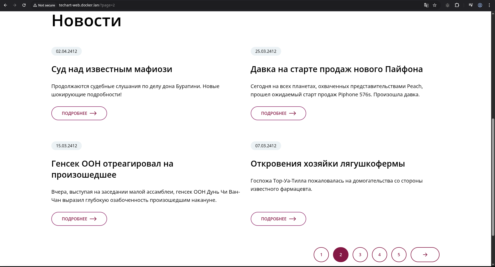
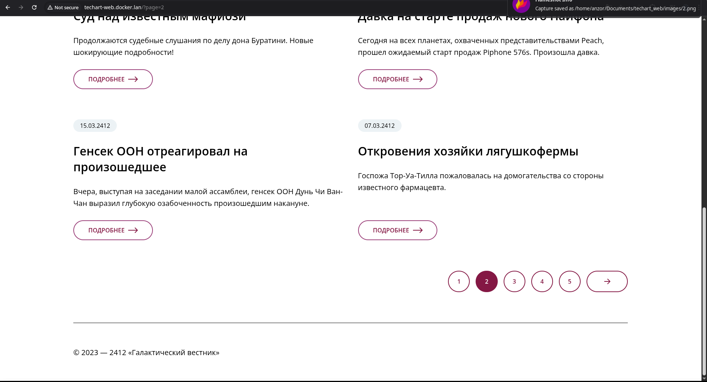
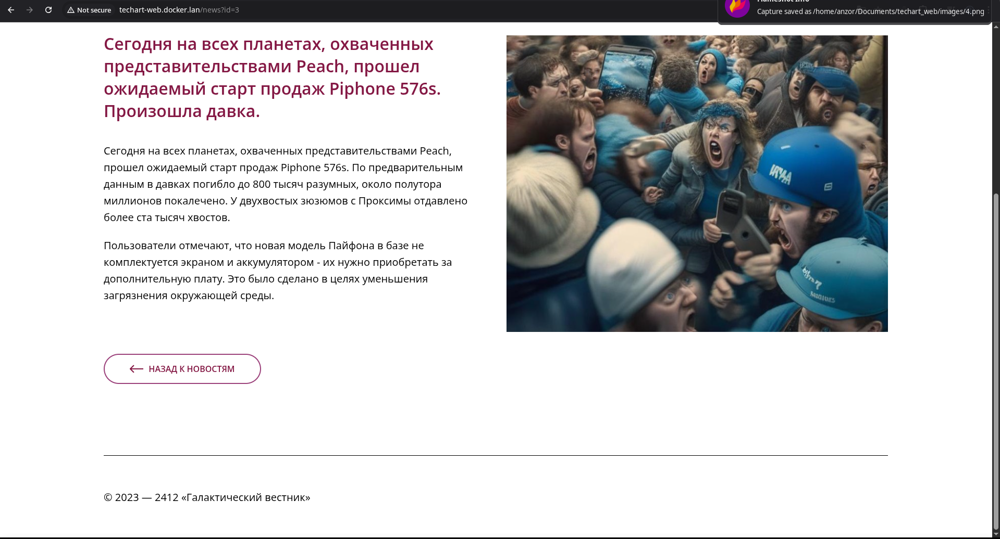

# Инструкция по развертыванию проекта

1. В .env файле в переменной `SITE_DOMAIN` прописать локальный домен, через который будет доступен сайт, или оставить по умолчанию.
2. Прописать данный домен в /etc/hosts или в настройках своего dns сервера, для резолвинга в localhost.
3. Запустить команду `docker compose up -d`, ждем когда развернется база данных
(для отслеживания успешности импорта базы данных вводим команду `docker compose logs db -f`) и переходим в браузере по домену, который мы указали в .env файле (не забываем проверить, что доступ произведен по http протоколу, а не https).

# Скриншоты
## 2-я страница списка

## детальная страница новости с идентификатором 3

